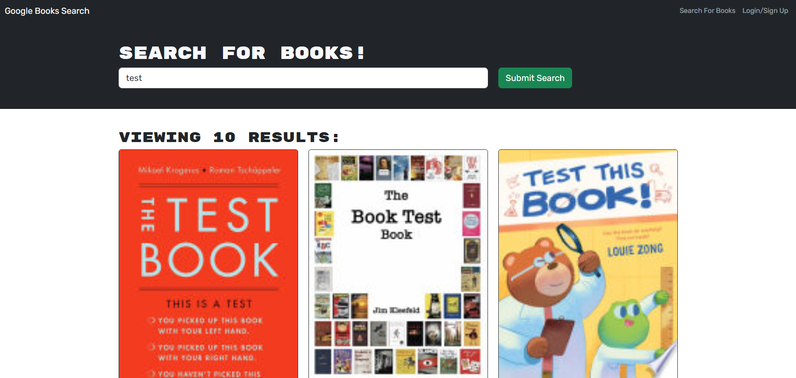

# Book Search Engine
[](https://opensource.org/licenses/MIT)
## Description
A project that utilizes the Google Books API. A user is able to search for a book and get back 10 results that match the query. <br>
The user can signup and login, which enables them to save books as they search. They can visit their saved books page and delete if needed. <br>

Technologies used:<br>


## Table of Contents
- [Installation](#installation)
- [Usage](#usage)
- [Contributing](#contributing)
- [Questions](#questions)
- [License](#license)

## Installation

- The user must clone the repo locally with this command:
```bash
git clone https://github.com/PhilipMcF/Book-Search-Engine.git
```
- Node.JS will be needed as well as the package manager to acquire the necessary modules:<br>
https://nodejs.org/en/download/package-manager

- Npm modules are needed in order to function properly so they will need to be installed. Run this command in the root directory where the repo is installed:
```bash
npm install
```

## Usage

[Visit the deployed site here!](https://book-search-engine-z4tc.onrender.com)

[](https://book-search-engine-z4tc.onrender.com)

To start the project, make sure you are in the root directory of the repo/project and run this command in a terminal window:
```bash
npm run build
```
You will then need to create a .env file in the root of the local project repo. It needs a MongoDB uri, a JWT secret key, and the NODE_ENV set to production. The name of the database can be changed to whatever you want instead of 'googlebooks':
```bash
NODE_ENV=production
MONGODB_URI=mongodb://127.0.0.1:27017/googlebooks
JWT_SECRET_KEY=setthesecretkeyhere
```
Then run this command in a terminal window from the root directory of the repo/project to start it:
```bash
npm run start
```
Go to http://localhost:3001 to start working/testing with the project!

## Contributing
[](https://www.contributor-covenant.org/version/2/1/code_of_conduct/)<br>
To contribute to this project, you can fork it or create an issue and provide any suggestions or solutions.
Please try and follow the Contributor Covenant code of conduct and leave a star if you like the project.

## Questions
For any and all questions, please contact me here:
- GitHub: https://github.com/PhilipMcF
- Email: philipsm1998@gmail.com

## License
[This project is licensed under the MIT license.](#https://opensource.org/license/mit)